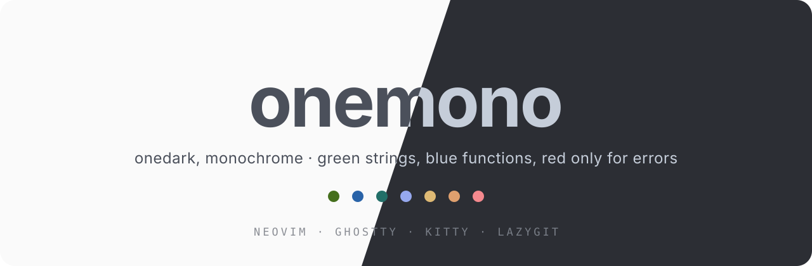
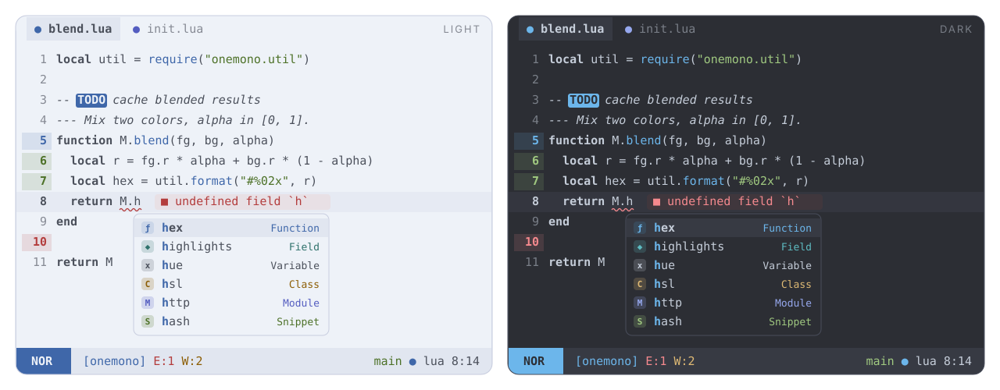

<p align="center">
  
</p>

<p align="center">
  <b>Onedark, quieted down.</b><br>
  A monochrome take on the Onedark palette: green strings, blue functions, and red only for errors and deletions.
</p>

<p align="center">
  
  
  
</p>

---

<p align="center">
  
</p>

## Philosophy

Onedark (and its variant [edge](https://github.com/sainnhe/edge)) is a
beautiful palette, but it paints keywords purple, variables red and
constants orange. Red code that is not an error is noise, and after a while
the rainbow stops telling you anything. **onemono** keeps the Onedark
backgrounds and hues, and cuts the syntax down to what earns a color:

- **Code is (almost) one color.** Keywords, variables, types, constants and
  operators all use the same foreground. Only two things get a hue:
  | Token | Color |
  | --- | --- |
  | strings | **green** |
  | functions and methods | **blue** |

  Everything else is told apart by shape. Comments are italic and keywords
  are bold by default, and you can change both. Set `mono = true` for pure
  monochrome.
- **Red means error.** It appears on diagnostics, error messages,
  `FIXME`/`BUG` markers and git deletions, and nowhere in code.
  A test checks this.
- **No purple, no pink.** They are not in the palette. Where a tool needs a
  "magenta" (ANSI color 5, mini.icons purple icons) it gets a calm azure.
- **Color where it means something:**
  | Where | Colors |
  | --- | --- |
  | Git (gitsigns, diff, lazygit) | add **green** · change **blue** · delete **red** |
  | Diagnostics | error red · warn yellow · info blue · hint cyan · ok green |
  | LSP completion kinds (blink.cmp, dropbar) | one color per kind, the same everywhere; functions blue and strings green, like the code |
  | File icons (mini.icons) | icon colors, with red folded into orange and purple into azure |
  | Search, `TODO` / `FIXME` / `NOTE` markers | attention colors |
- **Easy on the eyes.** The dark variant is a blue-leaning slate (`#232833`)
  with edge's cool off-white text; the light variant is a cool, blue-leaning paper (`#eef2f8`)
  with edge's soft graphite. Every accent passes **WCAG AA (≥ 4.5:1)** on both the
  background and the selection color (`scripts/contrast.lua`).

## Features

- Two variants, `light` and `dark`, plus `onemono`, which follows
  `'background'`. Neovim 0.10+ detects the terminal background (OSC 11), so the
  theme matches your terminal automatically.
- **Extreme performance.** Highlights are compiled to stripped LuaJIT
  bytecode with integer colors. A cached load is a single `loadfile()` and runs in
  **about 4 ms**, roughly 2× faster than the built-in `habamax`. The cache is
  keyed by a hash of your config, so it never goes stale.
- Built for **Neovim 0.12**. It covers every group the default colorscheme defines,
  plus `OkMsg`, `StderrMsg`, `StdoutMsg`, `DiffTextAdd`, `PmenuMatch`, `PmenuBorder`,
  `PmenuShadow`, `ComplMatchIns`, `SnippetTabstop*`, `DiagnosticVirtualLines*`,
  `LspReferenceTarget`, treesitter captures and LSP semantic tokens.
- **Matching themes for other tools**, generated from the same palette:
  Ghostty, Kitty and Lazygit.

## Supported plugins

| Plugin | Notes |
| --- | --- |
| [blink.cmp](https://github.com/saghen/blink.cmp) | menu, docs, signature, ghost text, **colored kinds** (also `CmpItemKind*`) |
| [mini.icons](https://github.com/echasnovski/mini.icons) | real icon colors |
| [mini.pick](https://github.com/echasnovski/mini.pick) / [mini.extra](https://github.com/echasnovski/mini.extra) | |
| [mini.files](https://github.com/echasnovski/mini.files) | |
| [mini.tabline](https://github.com/echasnovski/mini.tabline) | modified buffers in the git "change" blue |
| [gitsigns.nvim](https://github.com/lewis6991/gitsigns.nvim) | signs, `numhl`, `linehl`, inline, preview, staged, blame |
| [dropbar.nvim](https://github.com/Bekaboo/dropbar.nvim) | kind icons colored like the completion menu |
| [grug-far.nvim](https://github.com/MagicDuck/grug-far.nvim) | |
| [mason.nvim](https://github.com/mason-org/mason.nvim) | |
| [lazy.nvim](https://github.com/folke/lazy.nvim) | |
| [nvim-treesitter](https://github.com/nvim-treesitter/nvim-treesitter) | captures incl. `@markup.*`, `@diff.*`, `@comment.todo` … |

## Installation

[lazy.nvim](https://github.com/folke/lazy.nvim):

```lua
{
  "amonteirom96/onemono.nvim",
  lazy = false,
  priority = 1000,
  build = ":OnemonoCompile",
  opts = {},
  config = function(_, opts)
    require("onemono").setup(opts)
    vim.cmd.colorscheme("onemono")
  end,
}
```

Native `vim.pack` (Neovim 0.12):

```lua
vim.pack.add({ "https://github.com/amonteirom96/onemono.nvim" })
require("onemono").setup({})
vim.cmd.colorscheme("onemono")
```

### Colorschemes

| Command | Behavior |
| --- | --- |
| `:colorscheme onemono` | follows `'background'` (or the `variant` option) |
| `:colorscheme onemono-light` | always light |
| `:colorscheme onemono-dark` | always dark |

## Configuration

Calling `setup()` is optional. These are the defaults:

```lua
require("onemono").setup({
  variant = "auto",          -- "auto" (follow 'background') | "light" | "dark"
  transparent = false,       -- no background on Normal, floats and the sign column
  terminal_colors = true,    -- set g:terminal_color_0..15
  dim_inactive = false,      -- slightly different background on unfocused windows
  muted_comments = false,    -- comments in the muted UI tone instead of the code color
  mono = false,              -- strings and functions in the code color too (pure monochrome)
  float = {
    solid = false,           -- filled floats with an invisible border
  },
  styles = {                 -- any nvim_set_hl attributes (bold, italic, underline…)
    comments = { italic = true },
    keywords = { bold = true },
    functions = {},
    variables = {},
    strings = {},
    types = {},
    constants = {},
    operators = {},
  },
  integrations = {           -- set to false to skip a plugin's groups
    blink = true,
    dropbar = true,
    gitsigns = true,
    grug_far = true,
    lazy = true,
    mason = true,
    mini = true,             -- icons, pick, extra, files, tabline
    semantic_tokens = true,
    treesitter = true,
  },
  cache = true,              -- compile to bytecode (turn off only while hacking on the theme)

  --- Change the palette before any highlight is built.
  ---@param colors onemono.Colors
  ---@param variant "light"|"dark"
  on_colors = function(colors, variant) end,

  --- Add or change highlight groups.
  ---@param hl table<string, vim.api.keyset.highlight>
  ---@param colors onemono.Colors
  ---@param variant "light"|"dark"
  on_highlights = function(hl, colors, variant) end,
})
```

### Examples

**Pure monochrome.** No green or blue in code, and no bold or italic anywhere:

```lua
require("onemono").setup({
  mono = true,
  styles = { comments = {}, keywords = {} },
})
```

**Change which tokens get a color.** `c.code` holds the only two hues used in
code:

```lua
require("onemono").setup({
  on_colors = function(c)
    c.code.string = c.fg      -- strings back to the code color
    c.code.func = c.cyan      -- functions in cyan
  end,
})
```

**Darker background and a different accent for matches and prompts:**

```lua
require("onemono").setup({
  on_colors = function(c, variant)
    if variant == "dark" then
      c.bg = "#282c34" -- classic onedark
    end
    c.accent = c.green
  end,
})
```

**Custom statusline groups:**

```lua
require("onemono").setup({
  on_highlights = function(hl, c)
    local modes = {
      Normal = c.blue, Insert = c.green, Visual = c.azure,
      Replace = c.orange, Command = c.yellow, Other = c.cyan,
    }
    for mode, color in pairs(modes) do
      hl["StMode" .. mode] = { fg = c.bg, bg = color, bold = true }
      hl["StMode" .. mode .. "Sep"] = { fg = color, bg = c.surface2 }
    end
    hl.StProject = { fg = c.blue, bg = c.surface2 }
    hl.StGit = { fg = c.green, bg = c.surface2 }
    hl.StError = { fg = c.diag.error, bg = c.surface2 }
    hl.StWarn = { fg = c.diag.warn, bg = c.surface2 }
    hl.StInfo = { fg = c.diag.info, bg = c.surface2 }
    hl.StHint = { fg = c.diag.hint, bg = c.surface2 }
    hl.StLsp = { fg = c.accent, bg = c.surface2 }
  end,
})
```

## Palette

Taken from the Onedark family ([edge](https://github.com/sainnhe/edge)).
The light accents keep edge light's hues, darkened just enough to pass WCAG AA
on the cool paper background (from essential.nvim).

| Key | Light | Dark | Used for |
| --- | --- | --- | --- |
| `bg` | `#eef2f8` | `#232833` | background |
| `fg` | `#4b505b` | `#c5cdd9` | **code** |
| `green` | `#4d7128` | `#a0c980` | **strings**, git add, ok, snippets |
| `blue` | `#3f67a9` | `#6cb6eb` | **functions**, git change, info, `accent` |
| `red` | `#b33c3c` | `#f5898e` | **errors only**, git delete |
| `orange` | `#9b5522` | `#e0a06e` | kinds (enum, constant), substitute |
| `yellow` | `#8c5d04` | `#deb974` | warnings, kinds (class, struct) |
| `cyan` | `#2f716b` | `#5dbbc1` | hints, kinds (field, property) |
| `azure` | `#545dc0` | `#96a8ee` | kinds (module, keyword), ANSI magenta |

UI tones are derived from `fg` and `bg`, with a slight blue lean like edge's
`bg1`..`bg4`: `surface1`, `surface2`, `surface3`, `border`, `muted` and
`bg_dim`. `muted` appears only in UI chrome, such as line numbers and
whitespace. It never appears in code. `c.code.string` and `c.code.func` are
the two hues used in code.

Use the palette in your own config:

```lua
local c = require("onemono").colors()        -- current variant
local light = require("onemono").colors("light")
local groups = require("onemono").highlights("dark")
```

## Extras

Themes for other tools live in [`extras/`](extras). They are generated from the
palette and include your `on_colors` overrides when you regenerate them:

```vim
:OnemonoExtras [output-dir]
```

| Tool | Files | Setup |
| --- | --- | --- |
| **Ghostty** | `extras/ghostty/onemono-{light,dark}` | copy to `~/.config/ghostty/themes/`, then `theme = light:onemono-light,dark:onemono-dark` |
| **Kitty** | `extras/kitty/onemono-{light,dark}.conf` | copy them to `~/.config/kitty/light-theme.auto.conf` and `dark-theme.auto.conf` to follow the OS theme, or `include` one |
| **Lazygit** | `extras/lazygit/onemono-{light,dark}.yml` | `LG_CONFIG_FILE=~/.config/lazygit/config.yml,~/.config/lazygit/onemono-dark.yml` |

Lazygit's diff colors come from your terminal's ANSI palette, so they follow the
Ghostty or Kitty theme automatically. ANSI magenta (5 and 13) is azure, since
the palette has no purple.

## Commands

| Command | Description |
| --- | --- |
| `:OnemonoCompile` | Rebuild the bytecode cache. Run it after updating the plugin, or after changing values captured inside an `on_*` closure. |
| `:OnemonoClearCache` | Delete the cache (`stdpath("cache")/onemono`). |
| `:OnemonoExtras [dir]` | Generate the Ghostty, Kitty and Lazygit themes. |

## Development

```sh
# contrast check (WCAG AA for every accent, both variants)
nvim --headless -u NONE --cmd "set rtp^=." -l scripts/contrast.lua
# smoke tests (also checks that red appears only on errors and deletions)
nvim --headless -u NONE --cmd "set rtp^=." -l tests/smoke.lua
# load-time benchmark
nvim --headless -u NONE --cmd "set rtp^=." -l scripts/bench.lua
# regenerate extras and README images from the palette
nvim --headless -u NONE --cmd "set rtp^=." -c "lua require('onemono').extras()" -c q
nvim --headless -u NONE --cmd "set rtp^=." -l scripts/assets.lua
```

When you change highlight definitions, bump `M.version` in
`lua/onemono/init.lua`. This invalidates every user's compiled cache.

## Credits

Palette based on [edge](https://github.com/sainnhe/edge) by sainnhe, itself a
variant of Atom's One Dark. Structure based on
[essential.nvim](https://github.com/amonteirom96/essential.nvim).

## License

[MIT](LICENSE)
